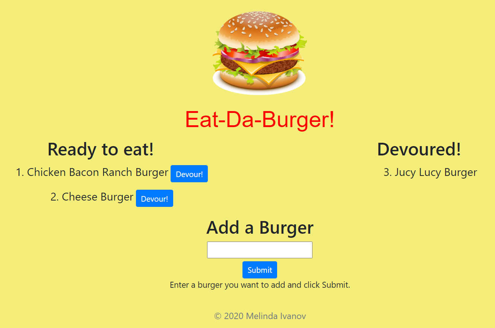

# Eat-Da-Burger

Eat-Da-Burger! is a restaurant app that lets users input the names of burgers they'd like to eat. Whenever a user submits a burger's name, your app will display the burger on the left side of the page waiting to be devoured. Each burger in the waiting area also has a Devour! button. When the user clicks it, the burger will move to the right side of the page. The app will store every burger in a database, whether devoured or not.

**Author:** Melinda Ivanov

## Links
- https://github.com/jnsmelinda/Eat-Da-Burger
- https://lit-mesa-27296.herokuapp.com/index

## Technologies
- [JavaScript](https://www.javascript.com)
- [Node.js](https://nodejs.org/en/)
- [HTML5](https://en.wikipedia.org/wiki/HTML5)
- [CSS3](https://en.wikipedia.org/wiki/Cascading_Style_Sheets)
- [Git](https://git-scm.com/), [GitHub](https://github.com)
- [MySQL](https://www.mysql.com/)
- [Docker](https://www.docker.com/)
- [Handlebars](https://handlebarsjs.com/)
- [MVC](https://en.wikipedia.org/wiki/Model%E2%80%93view%E2%80%93controller)
- [ORM](https://en.wikipedia.org/wiki/Object-relational_mapping)

## Installation
At first, you need to have [node.js](https://nodejs.org/) installed, then you need to install the required modules by running `npm install` in the command-line. You can choose to have Docker installed, than you need to run `docker-compose up` or you can install MySQL.

## Demo
You can watch the demo video [here](https://youtu.be/783PBATi0oU).

## Usage
Visit the heroku link and add a burger to the Reade to eat! section When you feel hungry simply Devour! it. 

## License
This repository is protected under the [MIT](https://choosealicense.com/licenses/mit/) license.

## Contribution
Please contribute to this project by opening a Pull Request and following the `eslint` rules and the [Code of Conduct](https://www.contributor-covenant.org/version/2/0/code_of_conduct/).

## Questions
You can contact me about issues and suggestions in [Email](mailto:jns.melinda@gmail.com), you can also find me on [Github](https://github.com/jnsmelinda).

## Others
Original desing is from the [University of Washington coding bootcamp](https://bootcamp.uw.edu).
 
© 2020 Melinda Ivanov
